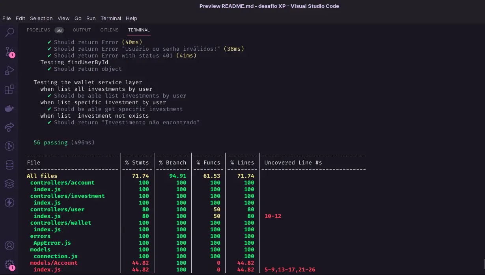

# Desafio XP.inc - Backend 


## Documentação com Swagger
https://desafio-xp.herokuapp.com/docs
 #

## Pontos Importantes
- Optei por utilizar o Docker pois facilita a implantação e economiza recursos frente a outras opções.

- Utilizei JWT (jsonwebtoken) pois é uma ótima estratégia tanto para autenticação quando para autorização. O JWT gera um token assinado onde é possível atribuir cargos para pessoas. Ao fazer uma requisição envia o token no header onde o sistema consegue identificar quais rotas a pessoa tem acesso.

- Para o banco de dados optei por utilizar o MYSQL que é um banco relacional, ou seja, é possível fazer relações entre tabelas desse modo posso salvar dados em uma tabela e atrela esse registro a outra tabela através de uma chave estrangeira.

- Durante o desenvolvimento utilizei o Eslint, dessa forma o código fica  mais padronizado e legível. Também configurei uma action no Github que verifica possíveis erros de lint ao fazer um push ou abrir uma pull request, não permitindo fazer o merge antes de corrigir os problemas apontados.

- Para os testes unitários utilizei a biblioteca chai em conjunto com Mocha para executar os testes, para gerar relatórios de cobertura utilizei a biblioteca c8. Na sessão  "Para executar os testes" é possível visualizar um print onde mostra os testes executados e o relatório gerado.

- Para o deploy utilizei o Heroku onde é possível fazer o deploy de aplicações desenvolvidas com Docker.
#

## Para executar o projeto você vai precisar
- [Docker](https://www.docker.com/)
- [Docker-Compose](https://docs.docker.com/compose/)
- [Node](https://nodejs.org/pt-br/)
- [MYSQL](https://www.mysql.com/)
- [Yarn](https://classic.yarnpkg.com/lang/en/docs/)
#

## Rodando com Docker

Clone o projeto

```bash
  git clone git@github.com:Laecio12/desafio-XP.git
```

Entre no diretório do projeto

```bash
  cd desafio-XP
```
Para abrir o projeto no VScode

```bash
  code .
```
## Variáveis de Ambiente

Para rodar esse projeto, você vai precisar adicionar as seguintes variáveis de ambiente no seu .env
#
`MYSQL_HOST=localhost`\
`MYSQL_USER=seuusuario`\
`MYSQL_PASSWORD=suasenha`\
`MYSQL_DATABASE=suaDatabase`\
`PORT=PORTA`
#
Código gerado no site: https://www.md5hashgenerator.com/ 

`JWT_SECRET=` 
#

Execute a criação dos containers
```bash
docker-compose up -d
```
Entre no container 
```bash
docker exec -it desafio_xp sh
```

Instale as dependências

```bash
  yarn
```

Inicie o servidor

```bash
  yarn run dev
```

#
## Para executar os testes 
```
  yarn run test:mocha
```
#
 
 #
## Stack utilizada
**Back-end:** Docker, Docker-Compose, Node, Express, JWT, MYSQL

#
## Autor

- [@Laecio](https://github.com/Laecio12)


